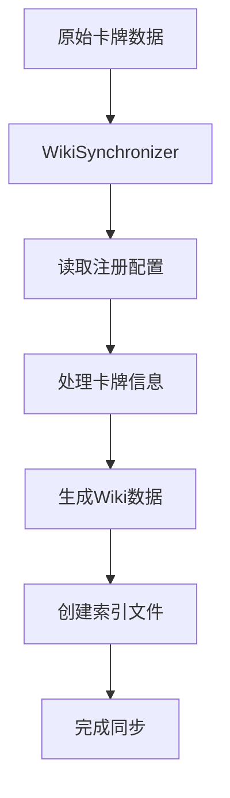
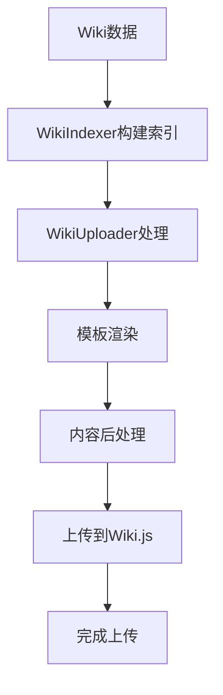
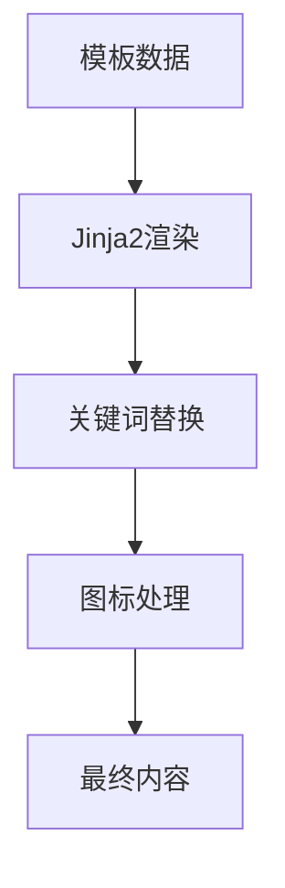

# Wiki.js 维护工具项目架构文档

## 项目概述

**项目名称**: wiki-js-maintenance-tools  
**项目类型**: Wiki.js 内容管理和自动化工具  
**主要功能**: 维护Wiki.js项目使用的常用代码工具，主要用于卡牌游戏数据的同步、渲染和上传  

## 项目结构

```
wiki-js-maintenance-tools/
├── README.md                 # 项目说明文档
├── LICENSE                   # 许可证文件
├── requirements.txt          # Python依赖包列表
├── .env                     # 环境配置文件
├── .gitignore              # Git忽略文件配置
├── .idea/                  # IDE配置目录
├── assets/                 # 静态资源目录
│   └── thumbnail/          # 缩略图资源
├── com/                    # 公共组件模块
│   ├── graphql.py          # GraphQL客户端
│   ├── singleton_type.py   # 单例模式实现
│   └── util.py             # 工具类
├── src/                    # 核心业务逻辑
│   ├── wiki_synchronizer.py # 数据同步器
│   ├── wiki_uploader.py    # 内容上传器
│   ├── wiki_renderer.py    # 内容渲染器
│   ├── wiki_template.py     # 模板处理器
│   ├── wiki_node.py        # 节点管理
│   ├── wiki_indexer.py     # 索引管理器
│   ├── html_extractor.py   # HTML提取器
│   ├── keyword_replacer.py # 关键词替换器
│   ├── text_formater.py    # 文本格式化器
│   ├── wiki_relation_register.py # 关系注册器
│   ├── card_relation_register.json # 卡牌关系配置
│   └── deck_json_register.json   # 卡组注册配置
└── data/                   # 数据存储目录
    ├── en/                 # 英文数据
    │   └── card_json/      # 英文卡牌原始数据
    └── zh/                 # 中文数据
        ├── card_json/       # 中文卡牌原始数据
        ├── card/           # 处理后的卡牌数据
        │   ├── accessory/  # 配件卡牌
        │   ├── exploration/ # 探索卡牌
        │   ├── intelligence/ # 情报卡牌
        │   ├── role/       # 角色卡牌
        │   └── trading/    # 交易卡牌
        ├── about/          # 关于页面
        ├── rule/           # 规则页面
        ├── templates/      # 模板文件
        ├── html/           # HTML文件
        └── *.json          # 配置数据文件
```

## 核心模块详解

### 1. 公共组件模块 (com/)

#### 1.1 GraphQL客户端 ([`com/graphql.py`](com/graphql.py:1))
- **类名**: [`WikiJSGraphQLClient`](com/graphql.py:19)
- **功能**: 提供Wiki.js GraphQL API的完整客户端接口
- **主要方法**:
  - [`login()`](com/graphql.py:44): 用户认证登录
  - [`get_page()`](com/graphql.py:127): 获取页面详情
  - [`get_page_by_path()`](com/graphql.py:159): 通过路径获取页面
  - [`create_page()`](com/graphql.py:261): 创建新页面
  - [`update_page()`](com/graphql.py:335): 更新现有页面
  - [`delete_page()`](com/graphql.py:446): 删除页面
  - [`list_pages()`](com/graphql.py:221): 获取页面列表
  - [`get_tags()`](com/graphql.py:472): 获取标签列表

#### 1.2 单例模式 ([`com/singleton_type.py`](com/singleton_type.py:1))
- **类名**: [`SingletonType`](com/singleton_type.py:17)
- **功能**: 线程安全的单例模式实现
- **特点**: 使用双重检查锁定确保线程安全

#### 1.3 路径工具 ([`com/util.py`](com/util.py:1))
- **类名**: [`PathUtil`](com/util.py:16)
- **功能**: 统一管理项目路径，使用单例模式
- **主要方法**:
  - [`getEnvFile()`](com/util.py:25): 获取环境配置文件路径
  - [`getSrcDir()`](com/util.py:29): 获取源代码目录路径
  - [`getDataDir()`](com/util.py:32): 获取数据目录路径
  - [`getModelsDir()`](com/util.py:35): 获取模型目录路径
  - [`getTmpDir()`](com/util.py:38): 获取临时目录路径

### 2. 核心业务逻辑 (src/)

#### 2.1 数据同步器 ([`src/wiki_synchronizer.py`](src/wiki_synchronizer.py:1))
- **类名**: [`WikiSynchronizer`](src/wiki_synchronizer.py:50)
- **功能**: 将卡牌设计数据同步到Wiki格式数据
- **主要流程**:
  1. 从[`card_json`](data/zh/card_json/)目录读取原始卡牌数据
  2. 根据[`deck_json_register.json`](src/deck_json_register.json:1)配置进行映射
  3. 处理卡牌信息（图片、标签、效果等）
  4. 生成处理后的卡牌数据到[`card`](data/zh/card/)目录
  5. 生成目录索引文件

- **关键方法**:
  - [`sync_card()`](src/wiki_synchronizer.py:203): 同步卡牌数据
  - [`sync_contents()`](src/wiki_synchronizer.py:356): 同步内容索引
  - [`dispose_card_info()`](src/wiki_synchronizer.py:95): 处理单张卡牌信息

#### 2.2 内容上传器 ([`src/wiki_uploader.py`](src/wiki_uploader.py:1))
- **类名**: [`WikiUploader`](src/wiki_uploader.py:30)
- **功能**: 将处理后的数据上传到Wiki.js服务器
- **环境支持**:
  - [`EnumUploadEnv.TEST`](src/wiki_uploader.py:27): 测试环境
  - [`EnumUploadEnv.PROD`](src/wiki_uploader.py:28): 生产环境

- **主要方法**:
  - [`upload()`](src/wiki_uploader.py:187): 批量上传文档
  - [`_upload()`](src/wiki_uploader.py:82): 上传单个文档
  - [`_save()`](src/wiki_uploader.py:62): 保存文档到本地

#### 2.3 内容渲染器 ([`src/wiki_renderer.py`](src/wiki_renderer.py:1))
- **类名**: [`WikiPTLRenderer`](src/wiki_renderer.py:31)
- **功能**: 渲染Wiki内容，支持关键词替换和图标处理
- **主要特性**:
  - 关键词自动链接化
  - 图标占位符替换
  - 支持Markdown和HTML格式

- **关键方法**:
  - [`render()`](src/wiki_renderer.py:137): 主渲染方法
  - [`_render_keyword_content()`](src/wiki_renderer.py:105): 关键词渲染
  - [`_render_icon_content()`](src/wiki_renderer.py:113): 图标渲染

#### 2.4 模板处理器 ([`src/wiki_template.py`](src/wiki_template.py:1))
- **类名**: [`Template`](src/wiki_template.py:21)
- **功能**: 基于Jinja2的模板处理系统
- **主要特性**:
  - 支持复杂模板语法
  - 自定义过滤器
  - 全局变量支持

- **关键方法**:
  - [`render()`](src/wiki_template.py:67): 渲染模板
  - [`add_filter()`](src/wiki_template.py:86): 添加自定义过滤器
  - [`add_global()`](src/wiki_template.py:95): 添加全局变量

#### 2.5 节点管理 ([`src/wiki_node.py`](src/wiki_node.py:1))
- **类名**: [`WikiNode`](src/wiki_node.py:22), [`DirectoryNode`](src/wiki_node.py:88), [`DocumentNode`](src/wiki_node.py:108)
- **功能**: 管理Wiki文档的树形结构
- **节点类型**:
  - [`WikiNode`](src/wiki_node.py:22): 基础节点类
  - [`DirectoryNode`](src/wiki_node.py:88): 目录节点，包含子节点
  - [`DocumentNode`](src/wiki_node.py:108): 文档节点，表示具体文件

### 3. 数据存储结构

#### 3.1 数据组织
- **多语言支持**: [`data/en/`](data/en/)和[`data/zh/`](data/zh/)目录分别存储英文和中文数据
- **数据类型**:
  - [`card_json/`](data/zh/card_json/): 原始卡牌设计数据
  - [`card/`](data/zh/card/): 处理后的卡牌Wiki数据
  - [`about/`](data/zh/about/): 关于页面数据
  - [`rule/`](data/zh/rule/): 规则页面数据
  - [`templates/`](data/zh/templates/): 模板文件

#### 3.2 卡牌分类
根据[`CARD_CONTENTS_REFLECTION`](src/wiki_synchronizer.py:21)定义，卡牌分为5类：
- **探索区卡牌** ([`exploration`](data/zh/card/exploration/)): 蓝色主题，63张
- **情报区卡牌** ([`intelligence`](data/zh/card/intelligence/)): 紫色主题，90张  
- **交易区卡牌** ([`trading`](data/zh/card/trading/)): 金色主题，45张
- **角色专属** ([`role`](data/zh/card/role/)): 红色主题，81张
- **其他卡牌** ([`accessory`](data/zh/card/accessory/)): 绿色主题，2张

## 工作流程

### 1. 数据同步流程


### 2. 内容上传流程


### 3. 内容渲染流程


## 配置文件

### 1. 环境配置 ([`.env`](.env:1))
- `WIKI_URL`: 测试环境Wiki.js地址
- `WIKI_API_TOKEN`: 测试环境API令牌
- `OFF_WIKI_URL`: 生产环境Wiki.js地址  
- `OFF_WIKI_API_TOKEN`: 生产环境API令牌

### 2. 注册配置
- [`deck_json_register.json`](src/deck_json_register.json:1): 卡组到卡牌文件的映射关系
- [`card_relation_register.json`](src/card_relation_register.json:1): 卡牌关系配置

### 3. 内容配置
- [`contents.json`](data/zh/contents.json:1): 站点整体内容结构
- [`card.json`](data/zh/card.json:1): 卡牌目录配置

## 依赖包分析

根据[`requirements.txt`](requirements.txt:1)，项目主要依赖：

1. **python-frontmatter**: 处理Markdown前置元数据
2. **libsass**: Sass样式编译
3. **beautifulsoup4**: HTML解析
4. **html5lib**: HTML5解析器
5. **jinja2**: 模板引擎
6. **python-dotenv**: 环境变量管理
7. **requests**: HTTP请求库

## 技术特点

### 1. 架构设计
- **模块化设计**: 功能模块清晰分离
- **单例模式**: 路径工具和配置管理使用单例
- **策略模式**: 渲染器支持多种渲染策略
- **工厂模式**: 节点创建使用工厂模式

### 2. 数据处理
- **多语言支持**: 支持中英文数据管理
- **批量处理**: 支持大量卡牌数据的批量同步
- **增量更新**: 智能检测内容变更，避免重复上传
- **错误处理**: 完善的异常处理和重试机制

### 3. 扩展性
- **模板系统**: 基于Jinja2的灵活模板系统
- **插件化**: 渲染器支持自定义扩展
- **配置驱动**: 通过配置文件控制数据处理流程

## 使用指南

### 1. 数据同步
```bash
python src/wiki_synchronizer.py
```

### 2. 内容上传
```bash
python src/wiki_uploader.py
```

### 3. 环境配置
在[`.env`](.env:1)文件中配置Wiki.js服务器地址和API令牌

## 项目优势

1. **自动化程度高**: 从数据同步到内容上传全流程自动化
2. **数据一致性**: 通过注册配置确保数据映射的一致性
3. **内容质量**: 丰富的渲染处理确保Wiki内容质量
4. **维护便捷**: 模块化设计便于功能扩展和维护
5. **多环境支持**: 支持测试和生产环境分离部署

## 总结

这是一个专业的Wiki.js内容管理系统，专门针对卡牌游戏数据的维护需求设计。项目采用模块化架构，具备完整的数据同步、内容渲染和上传功能，能够高效管理大量卡牌数据并自动生成高质量的Wiki内容。通过灵活的配置系统和强大的渲染引擎，项目具备良好的扩展性和维护性。